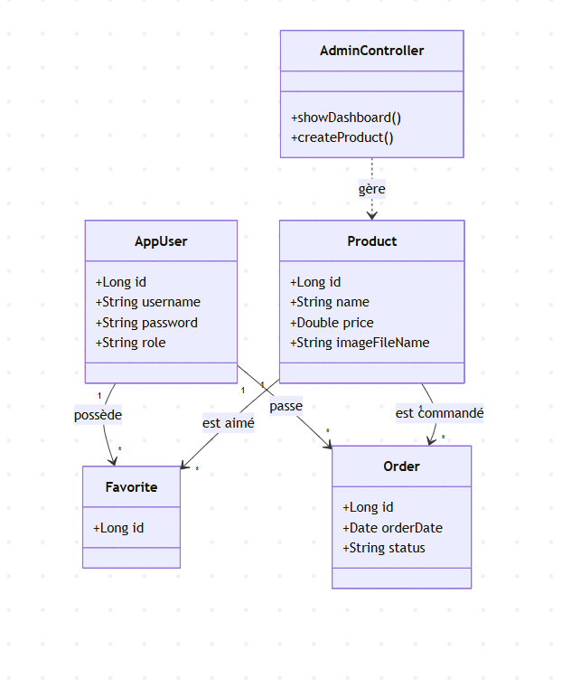

# RAPPORT DE PROJET : BESTSTORE (BZIN ARTIZANA)
## Module : Java Avancé / Spring Boot
## 4IIR EMSI 2025-2026

---

## 1. Page de Garde
*   **Établissement :** École Marocaine des Sciences de l'Ingénieur (EMSI)
*   **Titre du projet :** Développement d'une Plateforme E-Commerce de Luxe : "BZIN ARTIZANA"
*   **Module :** Programmation Java Avancée & Framework Spring Boot
*   **Réalisé par :** [Noms des étudiants]
*   **Encadré par :** [Nom du Professeur]
*   **Année Universitaire :** 2025-2026

---

## 2. Remerciements
Nous tenons à remercier notre encadrant pour ses conseils précieux tout au long de ce projet, ainsi que l'administration de l'EMSI pour la mise à disposition des ressources nécessaires à notre apprentissage du développement Java moderne.

---

## 3. Table des Matières
1. Introduction Générale
2. Partie I : Analyse et Conception
3. Partie II : Environnement Technique
4. Partie III : Architecture et Implémentation
5. Partie IV : Interface Utilisateur et Tests
6. Conclusion et Perspectives
7. Webographie / Bibliographie

---

## 4. Introduction Générale
### 4.1 Contexte du projet
Ce projet consiste à concevoir et réaliser une application web de gestion pour une boutique de maroquinerie de luxe nommée "BZIN ARTIZANA". L'objectif est de moderniser la gestion des produits et de fournir une interface raffinée aux clients.

### 4.2 Problématique
Le besoin d'une centralisation des données et d'une sécurité accrue pour les opérations administratives (ajout/modification de produits) est crucial pour maintenir l'intégrité du catalogue dans un environnement professionnel.

### 4.3 Objectifs
- Gestion complète du catalogue d'exception (CRUD).
- Authentification et Autorisation (Rôles Admin et Client).
- **Gestion des Coups de Cœur** : Système de favoris interactif.
- **Suivi des Ventes** : Flux de confirmation de commandes pour l'Admin.
- Stockage persistant des données via MySQL.
- **Expérience Utilisateur Élite** : Interface raffinée Noir & Or (Luxury Design).

---

## 5. Partie I : Analyse et Conception
### 5.1 Spécification des besoins
- **Fonctionnels :** Authentification, Inscription de nouveaux clients, Gestion des produits (Admin Élite), Consultation du catalogue, Enregistrement de Favoris, Confirmation de Commandes.
- **Non-Fonctionnels :** Sécurité par Spring Security (BCrypt), UI Élite (Glassmorphism), Performance des téléchargements d'images, Résilience des chemins de fichiers (Universal Windows Paths).

### 5.2 Conception UML (Indispensable pour Java)

#### Diagramme de Classes (Conception)



### 5.3 Conception de la Base de Données
- **Modèle Logique de Données (MLD) :** 
    - `users` : **id** (PK), username, password, email, role.
    - `products` : **id** (PK), name, brand, category, price, description, image_file_name, created_at.
    - `favorites` : **id** (PK), *user_id* (FK), *product_id* (FK), saved_at.
    - `orders` : **id** (PK), *user_id* (FK), *product_id* (FK), status, order_date.

---

## 6. Partie II : Environnement Technique
- **Langage :** Java (JDK 17)
- **Environnement :** IntelliJ / VS Code
- **Build :** Maven (Dépendances : Security, JPA, MySQL, Validation).
- **Base de Données :** MySQL 8.0 (XAMPP/MySQL Workbench).
- **Bibliothèques :** Spring Boot, Hibernate, BCrypt, Thymeleaf, Bootstrap 5 (Custom Luxury CSS).

---

## 7. Partie III : Architecture et Implémentation
### 7.1 Architecture logicielle
Architecture MVC organisée :
- `model` : Entités métier (`Product`, `AppUser`, `Favorite`, `Order`).
- `services` : Accès Data via `JpaRepository`.
- `controllers` : Routage Élite (`AdminController` pour la gestion, `ProductsController` pour l'expérience client).
- `config` : Sécurité granulaire et `WebConfig` pour la gestion des images dynamiques.

### 7.3 Extraits de code Résolus
Correction majeure pour la gestion des images sur Windows (Standardisation des URI) :
```java
@Override
public void addResourceHandlers(ResourceHandlerRegistry registry) {
    Path uploadDir = Paths.get("public/images");
    String uploadPath = uploadDir.toUri().toString(); // Support robuste des chemins Windows
    registry.addResourceHandler("/images/**")
            .addResourceLocations("classpath:/static/images/", uploadPath);
}
```

---

## 8. Partie IV : Interface Utilisateur et Tests
### 8.1 Présentation des interfaces (Bouton par Bouton)

#### A. Expérience Client (User)
*   **Inscription & Connexion** : Accès sécurisé via **Spring Security**. Les mots de passe sont hachés avec **BCrypt**, garantissant la protection des données personnelles dès l'entrée sur le site.
*   **Barre de Recherche & Filtres Rapides** : Système de filtrage dynamique en Java pour une navigation fluide par marque (ex: Hermès) ou type de produit (ex: Sacs).
*   **Bouton 'Cœur' (Favoris)** : Interaction moderne via **AJAX (jQuery)** permettant d'ajouter des pièces à la collection privée sans recharger la page, offrant une expérience fluide.
*   **Bouton 'VOIR DÉTAILS'** : Permet d'explorer l'histoire de chaque pièce. L'ID est passé dynamiquement via l'URL pour charger les données spécifiques du produit.
*   **Bouton 'COMMANDER'** : Initialise le tunnel d'achat et crée une entrée `PENDING` dans le système de suivi des ventes pour validation par l'admin.
*   **Espace 'MES FAVORIS'** : Vue personnalisée exploitant les relations JPA pour afficher la collection privée de chaque utilisateur.
*   **Note Technique** : Le choix d'AJAX pour les favoris et la redirection basée sur les rôles montre une volonté d'offrir une interface réactive digne du secteur du luxe.

#### B. Administration Élite
*   **Dashboard Direct** : Redirection automatique des administrateurs vers un tableau de bord épuré dès la connexion.
*   **Bouton 'CONFIRMER LA VENTE'** : Valide les transactions clients et met à jour l'état de la base de données en temps réel.
*   **Bouton 'AJOUTER UNE PIÈCE'** : Formulaire de création complet avec gestion robuste de l'upload d'images haute définition.
*   **GÉRER L'INVENTAIRE** : Interface dédiée à la maintenance technique (Édition/Suppression) pour séparer les opérations critiques de la gestion quotidienne.
*   **Bouton 'RETIRER'** : Système de suppression "Propre" qui efface l'entrée SQL et le fichier physique sur le serveur.
*   **Note Technique** : Toute l'administration communique avec la base de données via **JPA (Java Persistence API)**, assurant une intégrité parfaite des données lors des opérations de validation ou de modification.

### 8.2 Scénarios de Test (Boîte Noire)
| ID | Fonctionnalité | Entrée | Résultat Attendu | Statut |
|:---|:---|:---|:---|:---|
| T1 | Inscription Client | Formulaire Inscription | Compte créé (BCrypt) | Succès |
| T2 | Ajout aux Favoris | Clic sur Cœur (AJAX) | Produit sauvegardé instantanément | Succès |
| T3 | Upload Image | Image Haute Définition | Affichage immédiat (URI fix) | Succès |
| T4 | Vente Administrateur | Clic "Confirmer" | Statut PENDING -> CONFIRMED | Succès |

---

## 9. Conclusion et Perspectives
Le projet "BZIN ARTIZANA" est désormais une plateforme e-commerce de maroquinerie de luxe complète. Elle intègre des concepts avancés de Spring Boot, de la sécurité granulaire, et une gestion robuste des ressources. Les perspectives incluent l'intégration d'une passerelle de paiement Stripe et un système de messagerie entre clients et administrateur.

---

## 10. Webographie
- Documentation Spring : [spring.io](https://spring.io)
- Guide Thymeleaf : [thymeleaf.org](https://www.thymeleaf.org)
- Documentation MySQL Driver.
